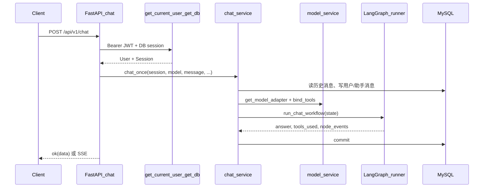

# Fengxuan Agent 后端代码说明

本文档与仓库当前实现一致，用于从架构到文件级熟悉后端。建议配合 IDE 全局搜索符号名、以及启动后的 OpenAPI（`/docs`）对照阅读。

---

## 1. 项目是做什么的

这是一个 **智能体对话后端**：用户注册登录后，配置自己的大模型（OpenAI 兼容 / Ollama / 远程端点），创建会话，通过 **LangGraph 工作流** 调用已绑定工具的 LangChain 模型完成多轮对话；可选绑定 **提示词模板**、**知识库（Chroma 向量检索）**、**MCP 动态工具**；并持久化消息与工具使用痕迹。

技术栈摘要见根目录 [README.md](../README.md)。

---

## 2. 分层架构（如何读代码）

后端采用常见的 **路由 → 依赖 → 服务 → 集成/工作流 → 数据访问** 结构，没有单独的 `repositories` 大包；业务多在 `app/services` 里直接用 SQLAlchemy `Session` 查询。

| 层次 | 目录 | 职责 |
|------|------|------|
| HTTP 入口 | `app/main.py` | 创建 FastAPI、CORS、挂载路由、生命周期、健康检查 |
| 路由聚合 | `app/api/router.py` | 所有 v1 子路由挂到 `/api/v1` |
| 具体接口 | `app/api/v1/*.py` | 参数校验、鉴权、调用 service、组装 `ok(...)` |
| 公共依赖 | `app/core/deps.py` | JWT 解析、`get_current_user` |
| 配置 | `app/core/config.py` | Pydantic Settings，读 `.env` |
| 安全与异常 | `app/core/security.py`、`app/core/exceptions.py` | 密码哈希、JWT、统一 JSON 错误体 |
| 数据库 | `app/db/session.py` | Engine、`SessionLocal`、`get_db`、ORM `Base` |
| 领域模型 | `app/models/*.py` | SQLAlchemy 2.x `Mapped` 映射表 |
| 请求/响应模型 | `app/schemas/*.py` | Pydantic，与 API 入参出参对应 |
| 业务服务 | `app/services/*.py` | 核心业务：鉴权、聊天、模型、知识库、MCP 等 |
| Agent 工作流 | `app/workflows/` | LangGraph：意图 → 规划 → 工具执行 → 答案 |
| 外部集成 | `app/integrations/` | 模型适配、Chroma 封装 |
| 内置工具 | `app/services/tools/` | LangChain `@tool`、内置工具注册表 |
| 数据库迁移 | `alembic/versions/` | 与 ORM 同步的 DDL 变更 |
| 测试 | `tests/` | pytest |

---

## 3. 请求生命周期（以「发一条聊天」为例）



- **流式**：`stream=true` 时仍先完整执行 `chat_once`（含工具调用），再把最终 `answer` 按固定字符长度切块用 SSE 推送（见 `app/api/v1/chat.py` 注释中的 Stage 1 约束）。

---

## 4. 入口文件 `app/main.py`

- **`FastAPI` 实例**：标题与 debug 来自 `get_settings()`。
- **CORS**：默认放行本地前端 `5173`（Vite 常见端口）。
- **`register_exception_handlers`**：把 `HTTPException`、`ValidationError`、`SQLAlchemyError` 等统一成 JSON（见下文「统一响应」）。
- **`api_router`**：前缀 `/api/v1`，具体路径由各子模块再拼前缀。
- **生命周期**  
  - `startup`：收集并日志打印含 `/api/v1/mcp` 的路由；探测 `mcp` SDK 是否在当前解释器可导入。  
  - `shutdown`：尽力关闭 MCP 子进程（`mcp_runtime_service.shutdown()`）。
- **`GET /health`**：存活探针，返回 `status` 与包版本 `version`（未安装分发包时为 `"dev"`）。

---

## 5. 配置 `app/core/config.py`

- 使用 **`pydantic-settings`**，默认读取项目根目录 **`.env`**。
- **MySQL**：`mysql_host` / `mysql_port` / `mysql_user` / `mysql_password` / `mysql_db`；若环境使用 `MYSQL_DATABASE`，可通过 `mysql_database` 兼容。
- **`sqlalchemy_database_uri`**：拼出 `mysql+pymysql://...`。
- **JWT**：`jwt_secret_key`、`jwt_algorithm`、访问/刷新令牌过期时间。
- **Chroma**：`chroma_persist_directory`（持久化目录）。
- **`get_settings()`**：`lru_cache` 单例，避免重复解析环境变量。

生产环境务必替换默认密钥与加密主密钥（`secret_encrypt_key` 等）。

---

## 6. 数据库与会话 `app/db/session.py`

- **`create_engine(..., pool_pre_ping=True)`**：连接池健康检查，适合长驻服务。
- **`SessionLocal`**：`autocommit=False, autoflush=False`，由业务显式 `commit/rollback`。
- **`get_db()`**：FastAPI 依赖生成器，`yield` 后 `finally` 关闭 session，**每个请求一个会话**。
- **`Base`**：所有 ORM 模型的基类；Alembic `env.py` 里 `target_metadata = Base.metadata`。

---

## 7. 认证与鉴权

### 7.1 OAuth2 与当前用户 `app/core/deps.py`

- **`OAuth2PasswordBearer(tokenUrl="/api/v1/auth/login")`**：约定客户端用表单登录拿 token（具体见 auth 路由实现）。
- **`get_current_user`**：从 `Authorization: Bearer` 解码 JWT，`sub` 为用户 id，查库得到 `User`；失败返回 401。

### 7.2 认证接口 `app/api/v1/auth.py` + `app/services/auth_service.py`

- **注册**：`POST /api/v1/auth/register`
- **登录**：`POST /api/v1/auth/login`，校验密码后签发 access + refresh（实现细节在 `auth_service`）。
- **刷新**：`POST /api/v1/auth/refresh`，校验 refresh token 行后重新签发。
- **`GET /api/v1/auth/me`**：需登录，返回当前用户基本信息。

### 7.3 用户与令牌模型

- **`app/models/user.py`**：`users` 表，用户名/邮箱唯一，`password_hash`。
- **`app/models/token.py`**：刷新令牌持久化（具体字段以模型为准）。

---

## 8. 统一响应与异常处理

### 8.1 成功体 `app/schemas/response.py`

业务接口普遍返回：

```json
{ "code": 0, "message": "success", "data": ... }
```

由 **`ok(data=...)`** 构造 `APIResponse`。FastAPI 会将其序列化为 JSON。

### 8.2 异常体 `app/core/exceptions.py`

- **`AppException`**：业务可抛，默认 HTTP 400，body 里 `code` 为自定义业务码。
- **`HTTPException`**：映射为对应 `status_code`，`message` 为 `detail`。
- **`ValidationError`**：422，常用于 Pydantic 校验失败。
- **`SQLAlchemyError`**：500，body 中带 `code: 5001` 与错误信息（生产环境可考虑隐藏内部细节）。

因此前端应同时看 **HTTP 状态码** 与 body 里的 **`code`**。

---

## 9. HTTP API 一览（前缀均为 `/api/v1`）

以下路径为 **router 前缀 + 子路由前缀 + 端点** 的组合，完整 OpenAPI 以运行中 `/openapi.json` 为准。

| 模块 | 前缀 | 主要职责 |
|------|------|----------|
| auth | `/auth` | 注册、登录、刷新、`/me` |
| models | `/models` | 当前用户的模型配置 CRUD |
| sessions | `/sessions` | 会话创建、列表、删除、消息分页 |
| chat | `/chat` | 对话（流式/非流式） |
| prompts | `/prompts` | 提示词模板 CRUD |
| knowledge-bases | `/knowledge-bases` | 知识库 CRUD、文本入库 |
| system | `/system` | 系统状态、运行环境快照（无密钥） |
| mcp | `/mcp` | MCP 能力查询、服务端配置 CRUD |
| agent-tools | `/agent-tools` | 工具目录、内置工具开关 |

### 9.1 系统模块 `app/api/v1/system.py`

- **`GET /system/status`**：需 DB，返回 LangChain/LangGraph 版本、MySQL/Chroma 探测结果、已加载模型列表摘要（实现：`system_service.get_system_status`）。
- **`GET /system/runtime`**：不访问 DB，返回 `app_name`、`app_env`、`app_port`、`app_debug`（`get_runtime_snapshot`），便于运维/学习时确认配置加载是否正确。

---

## 10. 领域模型与表（ORM）

导出列表见 `app/models/__init__.py`。核心实体关系（逻辑上）：

- **User** 1 — N **ModelConfig**、**ChatSession**、**PromptTemplate**、**KnowledgeBase**、**McpServerConfig** 等（均带 `user_id` 外键）。
- **ChatSession** 1 — N **ChatMessage**；会话可绑定默认 `model_config_id`；可选 **`client_label`**（客户端标签，可空）。
- **ChatMessage**：`role`（user/assistant）、`content`、`turn_index`；助手轮次可存 **`tools_used_json`**（工具名列表，供前端展示）。
- **KnowledgeBase**：含 **`chroma_collection`** 唯一名，对应 Chroma 中集合名。
- **KnowledgeDocument**：入库原文与元数据；向量写入由 `knowledge_base_service` + `vector_store` 完成。
- **UserBuiltinToolPref**：用户对内置工具的启用偏好（`agent_tool_service` 读取；表缺失时有降级逻辑）。
- **MCP 相关表**（`app/models/mcp.py`）：服务端配置、工具元数据、调用会话等，供 MCP 网关与运行时服务使用。

时间戳混入见 `app/models/base.py`（`TimestampMixin`）。

---

## 11. 对话核心链路

### 11.1 API 层 `app/api/v1/chat.py`

- 校验 **会话、模型** 归属当前用户；加载可选 **模板**、**知识库**。
- 调用 **`chat_service.chat_once`**。
- **非流式**：`ChatResponse` 打包进 `ok`；`output_mode=multimodal` 时附加占位字段（预留）。
- **流式**：SSE，`meta` → 多个 `chunk` → `final`，均含 `turn_count`、`notice`、`tools_used`。

### 11.2 服务层 `app/services/chat_service.py`

主要职责：

1. 根据已有消息数计算 **`turn_count`**，超过 30 轮给出 **`notice`**。
2. **`render_prompt`**：若有模板，替换 `{{question}}` / `{{context}}`；当前阶段 **不把知识库全文拼进 context**（注释写明：由 LLM 通过工具按需检索）。
3. 读取最近 **30 轮**（最多 60 条）消息，转成 **`HumanMessage` / `AIMessage`** 列表。
4. **`get_model_adapter`** → **`bind_tools(tools)`**，工具来自：  
   - **`build_builtin_langchain_tools`**（按用户偏好过滤，且 `retrieve_context` 仅在传入 `kb` 时加入）；  
   - **`build_mcp_dynamic_tools`**（按用户 MCP 配置动态生成 LangChain 工具）。
5. 组装 **`WorkflowState`**（含 `session_id`、`model_id` 便于日志追踪），调用 **`run_chat_workflow`**。
6. 将本轮 **用户原文** 与 **助手答案** 写入 **`ChatMessage`**，并把 **`tools_used`** 写入助手消息的 **`tools_used_json`**。
7. 若数据库缺少 **`tools_used_json`** 列，捕获特定错误并返回 **503** 与升级迁移提示。

### 11.3 LangGraph 工作流 `app/workflows/`

**图定义**（`runner.py`）：

`START → intent → plan → execute_tools → answer → END`

编译为模块级单例 **`CHAT_WORKFLOW`**，避免重复构图开销。

**状态**（`state.py`）：`WorkflowState` 为 `TypedDict`，包含：

- 用户侧：`user_message`、`context`、`prompt`
- 模型侧：`llm`（已 bind_tools）、`tools`
- 控制流：`need_tool`、`tool_plan`
- 执行结果：`agent_messages`、`answer`、`tools_used`、`node_events`
- 可选追踪：`session_id`、`model_id`（`NotRequired`）

**节点简述**：

| 节点文件 | 作用 |
|----------|------|
| `intent_node.py` | 根据关键词粗判本轮是否「可能需要工具」，写入 `need_tool` |
| `plan_node.py` | 若需要工具，把当前可用工具名列表写入 `tool_plan`（观测用） |
| `execute_tools_node.py` | **`langchain.agents.create_agent`**，用已绑定工具的 `llm` 与 `tools` 跑一轮；系统提示中约束何时调用 `retrieve_context` / `get_system_status` / `get_current_time` / `get_python_runtime` 等 |
| `answer_node.py` | 从 `agent_messages` 抽取最终助手文本，并用 **`tool_trace.collect_tool_names_from_agent_messages`** 得到有序工具名列表 |

**日志**（`runner.py`）：`WorkflowTrace` 一行内记录 `session_id`、`model_id` 与 `node_events`，便于排查。

---

## 12. 模型配置与适配器

### 12.1 配置模型 `app/models/model_config.py`

- **`model_type`**：`api` | `ollama` | `remote`（字符串约定，路由/服务层依赖此分支）。
- **`api_key_encrypted`**：加密存储；读写经 `app/utils/crypto.py`。
- **`base_url`**：OpenAI 兼容或 Ollama/远程基地址。
- **`model_params`**：JSON，如 `temperature`；`OpenAICompatibleAdapter` 会处理 **`extra_body`**（含 DeepSeek `thinking` 相关注释中的兼容逻辑）。

### 12.2 适配器 `app/integrations/model_adapters.py`

- 抽象类 **`ModelAdapter`**：`get_llm`、`invoke`、`bind_tools`（默认对底层 `ChatOpenAI`/`ChatOllama` 调用 `bind_tools`）、`invoke_ai_message` 等。
- **`OpenAICompatibleAdapter`**：基于 **`langchain_openai.ChatOpenAI`**。
- **`OllamaAdapter`**：基于 **`langchain_ollama.ChatOllama`**。
- **`RemoteEndpointAdapter`**：自定义 HTTP 类远程端点（见文件后半部分）。

路由入口：`app/services/model_service.py` 的 **`get_model_adapter`**。

---

## 13. 工具系统

### 13.1 内置工具注册表 `app/services/tools/builtin_registry.py`

- **`BUILTIN_TOOL_SPECS`**：唯一真相源，声明 `tool_key`、展示名、描述、是否依赖知识库。
- **`build_builtin_langchain_tools`**：按用户 **`enabled_by_key`** 过滤后，构造具体 LangChain Tool 实例列表。

内置实现分散在：

- `system_tools.py`：`get_system_status`
- `knowledge_tools.py`：`retrieve_context`（需 `kb.chroma_collection`）
- `time_tools.py`：`get_current_time`
- `runtime_tools.py`：`get_python_runtime`

新增内置工具的标准步骤：**加 Spec → 实现 `build_xxx_tool` → 在 `build_builtin_langchain_tools` 增加分支**（并视情况更新 `execute_tools_node` 的系统提示与意图关键词）。

### 13.2 用户开关与目录 API `app/services/agent_tool_service.py` + `app/api/v1/agent_tools.py`

- **`GET /agent-tools/catalog`**：内置工具元数据 + MCP 服务器信息等的聚合，供前端「扩展能力」页使用。
- **`PATCH /agent-tools/builtin/{tool_key}`**：更新 `UserBuiltinToolPref`；非法 `tool_key` 返回 400。

若数据库尚未迁移出 `user_builtin_tool_prefs` 表，服务层有 **容错**：默认全部内置工具开启，并打 warning 日志。

### 13.3 MCP 动态工具 `app/services/tools/mcp_tools.py`

在 **`chat_once`** 中与内置工具合并进同一 `tools` 列表；具体连接、会话生命周期由 **`mcp_runtime_service`**、**`mcp_gateway_service`**、**`mcp_server_service`** 等配合 `app/api/v1/mcp.py` 使用。

---

## 14. 知识库与向量存储

### 14.1 服务 `app/services/knowledge_base_service.py`

负责创建 KB（分配 `chroma_collection` 名）、删除 KB（含 Chroma 集合）、文本入库（写 `KnowledgeDocument` 并调用向量层）。

### 14.2 向量层 `app/integrations/vector_store.py`

- 使用 **`chromadb.PersistentClient`**，路径来自配置 **`chroma_persist_directory`**。
- **`ingest_text`**：按固定长度（800 字符）切块后 `collection.add`。
- **`retrieve`**：`query` 返回文档列表，供 `retrieve_context` 工具内部使用。

API 层：`app/api/v1/knowledge_bases.py`（CRUD + `POST .../ingest`）。

---

## 15. MCP 扩展（概念）

- **配置面**：`/api/v1/mcp/servers` CRUD；更新/删除时会通知 **`get_mcp_runtime_service().drop_handle`** 断开已有 stdio 会话。
- **能力面**：`/api/v1/mcp/capabilities` 异步聚合当前用户已启用 MCP 的工具列表（经 **`McpGatewayService`**）。
- **运行时**：`mcp_runtime_service` 管理子进程与 ClientSession；**`main` 关闭时 `shutdown`**。

细节以 `app/services/mcp_*.py` 与 `app/models/mcp.py` 为准；MCP 协议与版本约束见 `pyproject.toml` 中 `mcp`、`sse-starlette` 的注释说明。

---

## 16. 提示词模板 `app/services/prompt_service.py`

- 模板字符串中的 **`{{question}}`**、**`{{context}}`** 会被简单替换（非 Jinja2）。
- 无模板时，`render_prompt` 直接返回用户原始问题。

---

## 17. Alembic 迁移

- 配置入口：**`alembic/env.py`**，从 **`get_settings().sqlalchemy_database_uri`** 注入连接串；**`import app.models`** 确保元数据加载所有表。
- 版本文件：**`alembic/versions/*.py`**，按时间/序号递增；部署或本地开发在改模型后应 **`alembic revision`** 或手写迁移并 **`upgrade head`**。

若 ORM 与数据库不一致，聊天落库等路径会触发 **`chat_service`** 里针对缺列的显式 **503** 提示（例如缺少 `tools_used_json`）。

---

## 18. 日志 `app/core/logger.py`

在 `main` 启动时 **`setup_logging(settings.app_debug)`**；业务代码普遍使用 **`logging.getLogger("agent-backend")`** 或模块级 logger。

---

## 19. 测试与本地质量命令

见 [README.md](../README.md)：

- `pytest`：接口与健康检查、提示词渲染、向量层单测等。
- `ruff check .`：风格与部分静态问题。
- `mypy app`：类型检查（当前仓库可能存在历史告警，可逐步收紧）。

---

## 20. 扩展功能时的推荐修改顺序

按依赖从外到内，可减少返工：

1. **是否需要新表/列？** → 改 `app/models` → 写 `alembic/versions` → `upgrade head`。
2. **API 契约** → 在 `app/schemas` 增加/修改 Pydantic 模型。
3. **路由** → `app/api/v1` 新建或扩展现有 `APIRouter`，在 `app/api/router.py` 注册。
4. **业务** → `app/services` 实现核心逻辑；尽量保持「薄路由、厚服务」。
5. **若影响 Agent** → 扩展 `app/services/tools` 与 `builtin_registry`，或 MCP 相关服务；必要时更新 **`execute_tools_node`** 的系统提示与 **`intent_node`** 关键词。
6. **测试** → `tests/` 增加 `TestClient` 或纯单测。

---

## 21. 关键文件速查表

| 主题 | 文件路径 |
|------|----------|
| 应用入口 | `app/main.py` |
| 路由总表 | `app/api/router.py` |
| 对话 API | `app/api/v1/chat.py` |
| 对话业务 | `app/services/chat_service.py` |
| LangGraph | `app/workflows/runner.py`、`app/workflows/state.py`、`app/workflows/nodes/*.py` |
| 模型路由 | `app/services/model_service.py`、`app/integrations/model_adapters.py` |
| 内置工具表 | `app/services/tools/builtin_registry.py` |
| 工具偏好与目录 | `app/services/agent_tool_service.py`、`app/api/v1/agent_tools.py` |
| 知识库 API | `app/api/v1/knowledge_bases.py` |
| 向量存储 | `app/integrations/vector_store.py` |
| MCP API | `app/api/v1/mcp.py` |
| 配置 | `app/core/config.py` |
| DB 会话 | `app/db/session.py` |
| 统一成功体 | `app/schemas/response.py` |
| 异常处理 | `app/core/exceptions.py` |

---

文档版本：与仓库 `app/`、`alembic/` 当前结构同步维护；若你改动架构，请同步更新本节与速查表。
