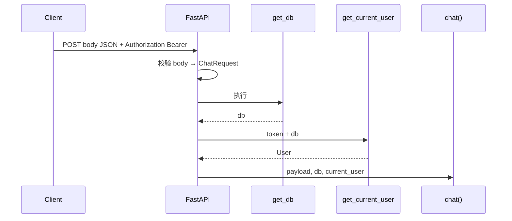
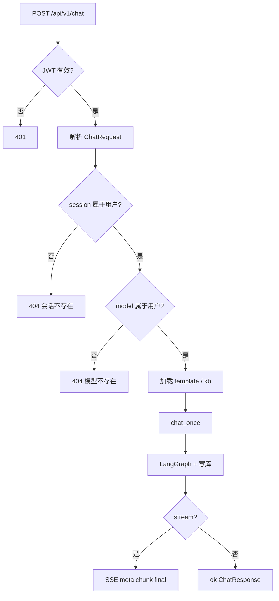

# `app/api/v1/chat.py` 精读说明

本文档对应你正在阅读的 **[app/api/v1/chat.py](../app/api/v1/chat.py)**，逐段说明「这行在干什么」「为什么这样写」「往下会调用谁」。

---

## 0. 这个文件在整体架构中的位置

```text
客户端 POST /api/v1/chat
        │
        ▼
┌───────────────────────────────────────┐
│  app/api/v1/chat.py   ← 你正在读的文件 │  薄：校验、组装参数、返回格式
└───────────────────────────────────────┘
        │ chat_once(...)
        ▼
┌───────────────────────────────────────┐
│  app/services/chat_service.py         │  厚：历史、工具、工作流、写库
└───────────────────────────────────────┘
        │ run_chat_workflow(...)
        ▼
┌───────────────────────────────────────┐
│  app/workflows/...                    │  LangGraph 四节点 + LLM
└───────────────────────────────────────┘
```

**设计原则**：路由层尽量薄；复杂逻辑都在 `chat_service` 和 `workflows`。

完整 URL 由两处拼接：

- `app/api/router.py`：`prefix="/api/v1"` + `prefix="/chat"`
- `chat.py`：`@router.post("")` → 空路径

最终：**`POST /api/v1/chat`**

---

## 1. 文件头注释（第 1～7 行）

```python
"""聊天 API，支持流式与非流式。

阶段一要求：
- stream=true 时也必须走工具调用链路（与非流式行为一致）...
- 工具调用过程对前端透明：SSE 只输出最终对话结果的分段与元信息。
"""
```

要点：

| 要求 | 含义 |
|------|------|
| 流式也要走工具 | `stream=true` 时**不是**边生成边返回，而是先完整跑完 `chat_once`（含工具调用），再把最终答案切块推送 |
| 对前端透明 | SSE 里不会出现「正在调用某某工具」的中间事件，只有 `meta` / `chunk` / `final` |

这是 **Stage 1** 的刻意设计，不是 token 级真流式。

---

## 2. import 区（第 9～22 行）

按类别理解：

| 导入 | 用途 |
|------|------|
| `json` | 把 Python 字典转成 SSE 里的 JSON 字符串 |
| `APIRouter, Depends, HTTPException` | FastAPI 路由与依赖、业务 404 |
| `StreamingResponse` | 流式响应（SSE） |
| `Session` | 数据库会话类型标注 |
| `get_current_user` | 从 JWT 解析当前登录用户 |
| `get_db` | 每个请求一个数据库连接 |
| `ChatSession` 等 **Model** | ORM，对应 MySQL 表 |
| `ChatRequest, ChatResponse` | **Schema**，请求/响应 JSON 形状 |
| `ok` | 包装成 `{code, message, data}` |
| `chat_once` | 真正干活的业务函数 |

---

## 3. 路由对象（第 24 行）

```python
router = APIRouter()
```

本文件只定义「聊天」相关端点；在 `router.py` 里被挂到 `/chat` 下。

---

## 4. 函数签名（第 27～28 行）— 最重要的一行

```python
@router.post("")
def chat(
    payload: ChatRequest,
    db: Session = Depends(get_db),
    current_user: User = Depends(get_current_user),
):
```

### 4.1 三个参数从哪来



| 参数 | 来源 | 说明 |
|------|------|------|
| `payload` | 请求 **JSON body** | 自动按 `ChatRequest` 校验 |
| `db` | `Depends(get_db)` | 本请求的 MySQL 会话 |
| `current_user` | `Depends(get_current_user)` | 已登录用户；无 token 或无效 → 401 |

### 4.2 `ChatRequest` 每个字段

定义在 [app/schemas/chat.py](../app/schemas/chat.py)：

| 字段 | 类型 | 必填 | 含义 |
|------|------|------|------|
| `session_id` | int | 是 | 哪个聊天会话 |
| `model_id` | int | 是 | 用哪条模型配置 |
| `message` | str | 是 | 用户本轮输入 |
| `stream` | bool | 否，默认 false | 是否 SSE 流式返回 |
| `template_id` | int \| null | 否 | 可选提示词模板 |
| `kb_id` | int \| null | 否 | 可选知识库（供检索工具用） |
| `output_mode` | str | 否，默认 "text" | `"multimodal"` 时多返回占位字段 |

Swagger 示例 body：

```json
{
  "session_id": 1,
  "model_id": 1,
  "message": "现在几点了？",
  "stream": false,
  "template_id": null,
  "kb_id": null,
  "output_mode": "text"
}
```

---

## 5. 权限与归属校验（第 29～36 行）

```python
session = db.get(ChatSession, payload.session_id)
if not session or session.user_id != current_user.id:
    raise HTTPException(status_code=404, detail="会话不存在")

model_config = db.get(ModelConfig, payload.model_id)
if not model_config or model_config.user_id != current_user.id:
    raise HTTPException(status_code=404, detail="模型不存在")

template = db.get(PromptTemplate, payload.template_id) if payload.template_id else None
kb = db.get(KnowledgeBase, payload.kb_id) if payload.kb_id else None
```

### 5.1 为什么要校验

防止用户 A 用用户 B 的 `session_id` 或 `model_id` 发消息（**越权**）。

### 5.2 逻辑拆解

| 步骤 | 代码 | 失败时 |
|------|------|--------|
| 查会话 | `db.get(ChatSession, id)` | 不存在或 `user_id` 不匹配 → **404**「会话不存在」 |
| 查模型 | `db.get(ModelConfig, id)` | 同上 → **404**「模型不存在」 |
| 可选模板 | 有 `template_id` 才查 | 无效 id 时 `db.get` 得 None，后面 `render_prompt` 当无模板 |
| 可选知识库 | 有 `kb_id` 才查 | 无 kb 则聊天时不会挂 `retrieve_context` 工具 |

注意：模板和知识库这里**没有**再校验 `user_id`（若 id 属于别人，`get` 仍可能拿到对象）。更严的做法应在 service 或此处加 `template.user_id == current_user.id`；当前实现依赖前端传正确 id。

### 5.3 `db.get` 是什么

SQLAlchemy 2.x：按主键查一行，没有则返回 `None`。

---

## 6. 分支一：流式 `stream=true`（第 38～58 行）

```python
if payload.stream:
    answer, turn_count, notice, tools_used = chat_once(...)
    async def event_generator():
        yield ...  # meta
        yield ...  # chunk × N
        yield ...  # final
    return StreamingResponse(event_generator(), media_type="text/event-stream")
```

### 6.1 执行顺序（关键）

```text
1. 同步执行 chat_once()  ← 可能很慢（LLM + 工具 + 写库）
2. 拿到完整 answer 字符串
3. 才开始 async generator，把 answer 切成 120 字一块块 yield
```

所以用户感觉「在流式输出」，但**思考与工具调用早已结束**。

### 6.2 SSE 格式

每条事件一行，形如：

```text
data: {"type":"meta",...}

```

（空行表示一条事件结束，符合 Server-Sent Events 惯例。）

### 6.3 三类事件

| type | 何时发送 | 字段 | 前端用途 |
|------|----------|------|----------|
| `meta` | 最先 1 条 | `turn_count`, `notice`, `tools_used` | 先展示「本轮用了哪些工具」、轮次提示 |
| `chunk` | 多条 | `text` | 逐段显示答案（每段最多 120 字符） |
| `final` | 最后 1 条 | 完整 `answer` + 同上元信息 | 收尾、校对、存本地状态 |

`chunk_size = 120` 是**字符数**，不是 token；中文一般 1 字 1 字符。

### 6.4 示例（简化）

```text
data: {"type":"meta","turn_count":1,"notice":null,"tools_used":["get_current_time"]}

data: {"type":"chunk","text":"当前时间是..."}

data: {"type":"final","answer":"当前时间是...","turn_count":1,"notice":null,"tools_used":["get_current_time"]}

```

### 6.5 为什么用 `async def event_generator`

FastAPI 的 `StreamingResponse` 接受异步生成器；`yield` 在生成器里逐块推送，避免一次性把巨大 body 放进内存（虽然本实现 answer 已在内存里）。

---

## 7. 分支二：非流式 `stream=false`（第 60～64 行）

```python
answer, turn_count, notice, tools_used = chat_once(
    db, session, model_config, payload.message, template, kb
)
data = ChatResponse(
    answer=answer,
    turn_count=turn_count,
    notice=notice,
    tools_used=tools_used,
).model_dump()
if payload.output_mode == "multimodal":
    data["multimodal_placeholder"] = {"image": None}
return ok(data)
```

### 7.1 `chat_once` 返回值

四元组：

| 变量 | 类型 | 含义 |
|------|------|------|
| `answer` | str | 助手最终回复全文 |
| `turn_count` | int | 当前第几轮对话 |
| `notice` | str \| None | 超过 30 轮时的提示文案 |
| `tools_used` | list[str] | 本轮调用的工具名列表 |

### 7.2 响应 JSON 结构

`ok(data)` 包装后：

```json
{
  "code": 0,
  "message": "success",
  "data": {
    "answer": "……",
    "turn_count": 1,
    "notice": null,
    "tools_used": ["get_current_time"]
  }
}
```

`output_mode == "multimodal"` 时 `data` 多一个占位字段（预留，当前无真实多模态）：

```json
"multimodal_placeholder": { "image": null }
```

---

## 8. `chat_once` 内部在做什么（必读关联文件）

`chat.py` 只调用一次 `chat_once`；下面便于你「跟下去读」。

| 步骤 | 位置 | 做什么 |
|------|------|--------|
| 1 | 计数 | `msg_count` → `turn_count = msg_count//2 + 1` |
| 2 | 提示词 | `render_prompt(template, user_message)` |
| 3 | 历史 | 查最近 60 条 `ChatMessage` → `HumanMessage` / `AIMessage` |
| 4 | 工具 | 内置工具 + MCP 动态工具，`bind_tools` 到 LLM |
| 5 | 工作流 | `run_chat_workflow(state)` → 得到 `answer`, `tools_used` |
| 6 | 落库 | `db.add` 用户消息 + 助手消息，`db.commit()` |

详细代码见 [app/services/chat_service.py](../app/services/chat_service.py)。

**注意**：写入库的 `content` 里，用户消息是 **原始** `user_message`，不是渲染后的模板全文；渲染结果只用于发给 LLM 的 `prompt`。

---

## 9. 完整请求生命周期图



---

## 10. 本文件「不负责」的事

| 事项 | 负责文件 |
|------|----------|
| 创建会话 | `app/api/v1/sessions.py` |
| 配置模型 | `app/api/v1/models.py` |
| LLM 调用与工具执行 | `chat_service` + `workflows/nodes/execute_tools_node.py` |
| 登录拿 token | `app/api/v1/auth.py` |

---

## 11. 常见问题

**Q：为什么流式和非流式都调同一个 `chat_once`？**  
A：保证行为一致（轮次、工具、答案内容相同），只差返回方式。

**Q：`template_id` 传了但模板不存在会怎样？**  
A：`db.get` 得 `None`，`render_prompt` 当无模板，直接用用户原话。

**Q：404 和 401 区别？**  
A：401 在 `get_current_user` 阶段（没登录）；404 是资源不存在或不属于当前用户。

**Q：如何调试？**  
A：终端看 `chat_once: session_id=...` 日志；Swagger 试 `stream: false` 先看完整 JSON；流式用浏览器 Network → EventStream。

---

## 12. 阅读检查清单

读完 `chat.py` 后，你应能回答：

- [ ] 完整 URL 和 HTTP 方法是什么？
- [ ] `payload` / `db` / `current_user` 各从哪来？
- [ ] 为什么要检查 `session.user_id == current_user.id`？
- [ ] `stream=true` 时，答案何时生成完毕？何时才开始推送 chunk？
- [ ] 非流式成功响应的 JSON 长什么样？
- [ ] 下一层该打开哪个文件继续读？

建议下一步：打开 [app/services/chat_service.py](../app/services/chat_service.py)，对照本文第 8 节逐步跟读。

相关总览：[LEARNING_PHASE_03_CHAT.md](LEARNING_PHASE_03_CHAT.md)
