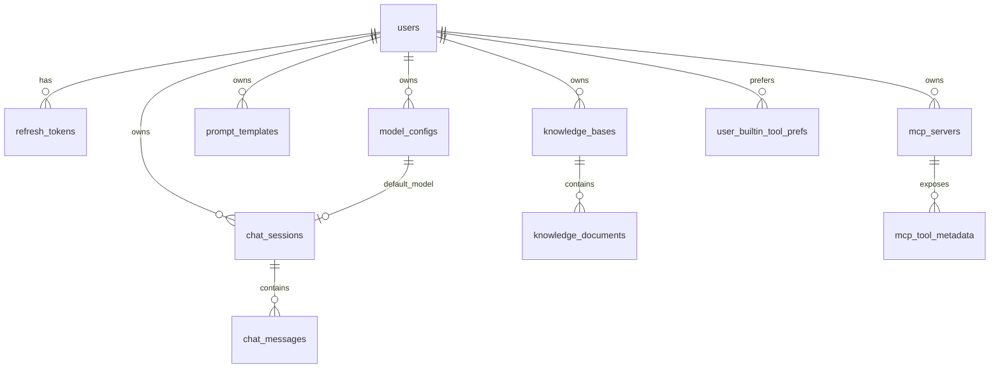

# 阶段 2：数据库与模型（详细版）

本章说明：数据存在哪、Python 类如何对应 MySQL 表、代码里如何查/写、表结构如何升级。

---

## 0. 先建立三个概念

| 概念 | 是什么 | 在本项目的位置 |
|------|--------|----------------|
| **MySQL** | 真正存数据的磁盘数据库 | `.env` 里 `MYSQL_*` 配置 |
| **ORM Model** | Python 类 ↔ 一张表 | `app/models/*.py` |
| **Session (`db`)** | 一次请求里操作数据库的「手柄」 | `get_db()` → 路由里 `db: Session` |

**和 schemas 的区别**（阶段 1 已学）：

- `schemas`：HTTP 进出的 JSON 形状（给前端看）
- `models`：MySQL 表里的行（给持久化用）

---

## 1. 连接层：`app/db/session.py`

### 1.1 三样东西

```text
engine          ← 连接池，连到 MySQL（整个进程一个）
SessionLocal    ← 工厂：每次需要时 new 一个 Session
get_db()        ← FastAPI 依赖：每个 HTTP 请求借一个 Session，结束关闭
```

核心代码：

```python
engine = create_engine(settings.sqlalchemy_database_uri, pool_pre_ping=True, ...)
SessionLocal = sessionmaker(bind=engine, autocommit=False, autoflush=False, ...)

def get_db():
    db = SessionLocal()
    try:
        yield db      # 交给路由函数使用
    finally:
        db.close()      # 请求结束必须关闭
```

| 参数 | 含义 |
|------|------|
| `pool_pre_ping=True` | 从池里取连接前先 ping，避免 MySQL 断线后用到坏连接 |
| `autocommit=False` | 不会自动提交；要 `db.commit()` 才真正写入 |
| `autoflush=False` | 不会每次 query 前自动 flush；由业务控制 |

### 1.2 `Base` 是什么

```python
class Base(DeclarativeBase):
    pass
```

所有 `app/models` 里的表类都继承 `Base`。Alembic 通过 `Base.metadata` 知道项目有哪些表。

---

## 2. 模型基类：`app/models/base.py`

很多表都有创建/更新时间，抽成 **Mixin**（混入）：

```python
class TimestampMixin:
    created_at: Mapped[datetime] = mapped_column(DateTime, server_default=func.now(), ...)
    updated_at: Mapped[datetime] = mapped_column(DateTime, server_default=func.now(), onupdate=func.now(), ...)
```

使用方式：`class User(Base, TimestampMixin)` → `users` 表自动多两列。

---

## 3. ORM 字段写法速查

以 `ChatMessage` 为例：

```python
id: Mapped[int] = mapped_column(primary_key=True, autoincrement=True)
session_id: Mapped[int] = mapped_column(ForeignKey("chat_sessions.id", ondelete="CASCADE"), ...)
role: Mapped[str] = mapped_column(String(32), nullable=False)
tools_used_json: Mapped[list[str] | None] = mapped_column(JSON, nullable=True)
```

| 写法 | 含义 |
|------|------|
| `Mapped[int]` | Python 侧类型 |
| `primary_key=True` | 主键 |
| `ForeignKey("users.id")` | 外键，指向另一张表 |
| `ondelete="CASCADE"` | 删用户时，级联删其会话/消息等 |
| `nullable=False` | 不能为空 |
| `unique=True` | 唯一（如用户名） |
| `JSON` | 存 JSON 数组/对象（如工具名列表） |

`__tablename__ = "chat_messages"`：类名是 `ChatMessage`，表名是蛇形复数。

---

## 4. 全表关系图（逻辑 ER）



**中心是 `users`**：几乎所有业务表都有 `user_id`，保证「只能操作自己的数据」。

---

## 5. 每张表是干什么的

### 5.1 用户与认证

| 表 | Model | 主要字段 | 用途 |
|----|-------|----------|------|
| `users` | `User` | username, email, password_hash | 账号；密码存哈希，不存明文 |
| `refresh_tokens` | `RefreshToken` | token, expires_at, user_id | 刷新 JWT 用 |

### 5.2 对话（最常被读）

| 表 | Model | 主要字段 | 用途 |
|----|-------|----------|------|
| `chat_sessions` | `ChatSession` | user_id, title, model_config_id, client_label | 一个聊天窗口/线程 |
| `chat_messages` | `ChatMessage` | session_id, role, content, turn_index, tools_used_json | 每条消息 |

**`role`**：通常是 `"user"` 或 `"assistant"`。

**`turn_index`**：第几轮对话（一轮 = 用户一句 + 助手一句）。

**`tools_used_json`**：助手那条消息调用了哪些工具，如 `["get_current_time"]`（后来迁移加的列）。

### 5.3 模型配置

| 表 | Model | 主要字段 | 用途 |
|----|-------|----------|------|
| `model_configs` | `ModelConfig` | model_type, model_name, api_key_encrypted, base_url, model_params | 用户配置的大模型（api/ollama/remote） |

API Key 加密存在 `api_key_encrypted`，读取时用 `app/utils/crypto.py` 解密。

### 5.4 提示词与知识库

| 表 | Model | 用途 |
|----|-------|------|
| `prompt_templates` | `PromptTemplate` | 用户保存的提示词模板 |
| `knowledge_bases` | `KnowledgeBase` | 知识库元数据；`chroma_collection` 对应 Chroma 集合名 |
| `knowledge_documents` | `KnowledgeDocument` | 入库的原文；向量在 Chroma，不在 MySQL |

### 5.5 MCP 与工具偏好

| 表 | Model | 用途 |
|----|-------|------|
| `mcp_servers` 等 | `McpServerConfig` 等 | MCP 子进程配置与工具元数据 |
| `user_builtin_tool_prefs` | `UserBuiltinToolPref` | 用户是否开启某个内置工具 |

完整导出列表见 `app/models/__init__.py`。

---

## 6. 代码里怎么用 `db`（CRUD 对照）

### 6.1 查一条（按主键）

```python
session = db.get(ChatSession, payload.session_id)
user = db.get(User, user_id)
```

相当于 `SELECT * FROM chat_sessions WHERE id = ?`。

### 6.2 条件查询

```python
rows = (
    db.query(ChatMessage)
    .filter(ChatMessage.session_id == session.id)
    .order_by(ChatMessage.created_at.asc())
    .all()
)
```

`chat_service.chat_once` 用这段读历史，再取最后 60 条组成上下文。

### 6.3 统计

```python
msg_count = db.query(ChatMessage).filter(ChatMessage.session_id == session.id).count()
turn_count = (msg_count // 2) + 1
```

消息条数 ÷ 2 ≈ 对话轮数（每轮 2 条消息）。

### 6.4 新增（尚未写入磁盘）

```python
db.add(ChatMessage(session_id=..., role="user", content=user_message, turn_index=turn_count))
db.add(ChatMessage(..., role="assistant", content=answer, tools_used_json=tools_used))
```

### 6.5 提交与回滚

```python
db.commit()    # 真正 INSERT/UPDATE
db.rollback()  # 出错时撤销本次事务内的修改
```

**重要**：`db.add` 之后必须 `commit()`，否则别的连接查不到；请求结束 `get_db` 会 `close`，未 commit 的改动会丢。

---

## 7. 一条聊天如何落库（串联阶段 2 和 3）

```text
1. chat.py 用 db.get 校验 ChatSession、ModelConfig 属于当前用户
2. chat_once 用 db.query 读历史 ChatMessage
3. 跑完 LangGraph 得到 answer、tools_used
4. db.add 两条 ChatMessage（user + assistant）
5. db.commit()
```

发一句「你好」后，`chat_messages` 应多 **2 行**：

| role | content | turn_index | tools_used_json |
|------|---------|------------|-----------------|
| user | 你好 | 1 | NULL |
| assistant | （模型回复） | 1 | 可能为 ["get_xxx"] 或 NULL |

---

## 8. Alembic：表结构如何演进

### 8.1 为什么需要迁移

改 `app/models` 里的字段后，**MySQL 表不会自动变**。要用 Alembic 生成/执行迁移脚本。

```bash
poetry run alembic upgrade head   # 应用到最新版本
```

### 8.2 迁移链（本项目）

| 版本文件 | 做了什么 |
|----------|----------|
| `20260429_0001_init.py` | 创建 users、chat、model、knowledge、prompt 等初始表 |
| `20260429_0002_mcp_tables.py` | MCP 相关表 |
| `20260509_0003_user_builtin_tool_prefs.py` | 内置工具开关表 |
| `20260509_0004_chat_messages_tools_used.py` | `chat_messages.tools_used_json` 列 |
| `20260513_0005_chat_sessions_client_label.py` | `chat_sessions.client_label` 列 |

`alembic/env.py` 从 `get_settings()` 读数据库 URL，并 `import app.models` 加载所有 Model。

### 8.3 缺列时的报错

若未跑迁移 0004，`chat_service` 提交时会失败，返回 **503** 并提示执行 `alembic upgrade head`（见 `chat_service.py` 里对 `tools_used_json` 的检测）。

### 8.4 你以后加字段的标准流程

1. 改 `app/models/xxx.py`
2. 新建 `alembic/versions/xxxx_描述.py`（`upgrade` 里 `add_column` 等）
3. `poetry run alembic upgrade head`
4. 若有 API 字段，再改 `schemas` 和路由

---

## 9. 阅读顺序（建议）

| 天 | 文件 | 目标 |
|----|------|------|
| 1 | `app/db/session.py` | 理解 engine / Session / get_db |
| 1 | `app/models/base.py` | 理解 Mixin |
| 2 | `app/models/user.py`、`chat.py` | 最核心两张业务表 |
| 2 | `app/services/chat_service.py` 里所有 `db.` | 看真实用法 |
| 3 | `app/models/model_config.py`、`knowledge_base.py` | 扩展表 |
| 3 | `alembic/versions/20260429_0001_init.py` | 对照 ORM 看 DDL |
| 4 | 其余 4 个 migration | 理解项目演进 |

---

## 10. 动手练习（带检查点）

### 练习 A：用客户端看表

1. 用 DBeaver / MySQL Workbench 连接 `agent_backend`
2. `SELECT * FROM users LIMIT 5;`
3.  Swagger 发一条聊天后：`SELECT * FROM chat_messages ORDER BY id DESC LIMIT 4;`
4. 确认有 user + assistant 两行，`turn_index` 相同

### 练习 B：对照 ORM

打开 `ChatMessage`，在表里找到对应列：`role`、`content`、`tools_used_json`。

### 练习 C：故意不迁移（可选）

若你有多套环境，可理解：ORM 有字段、表里没有列 → `commit` 报错 → 503 提示。

---

## 11. 读懂标志（自检）

- [ ] 能解释 `db.get` 和 `db.query(...).filter(...)` 的区别
- [ ] 知道 `commit` 之前数据只在当前事务里
- [ ] 看到 `ForeignKey(..., ondelete="CASCADE")` 知道删用户会连带删会话
- [ ] 能说出聊天后 `chat_messages` 为什么 +2 行
- [ ] 知道改表要走 Alembic，不是只改 Python 类

---

## 12. 常见疑问

**Q：Chroma 和 MySQL 各存什么？**  
A：MySQL 存用户、会话、消息、KB 元数据、文档原文；**向量**在 Chroma（`CHROMA_PERSIST_DIRECTORY`），检索时不经过 `chat_messages` 表的全文拼接。

**Q：为什么没有 `repositories` 包？**  
A：本项目把查询写在 `services` 里，直接用 `db`，没有单独 Repository 层。

**Q：`db.flush()` 和 `commit()`？**  
A：本项目多数路径只用 `commit()`；`flush` 会把 pending 的 SQL 发到库但未提交事务，这里了解即可。

---

下一步：[LEARNING_PHASE_03_CHAT.md](LEARNING_PHASE_03_CHAT.md)
